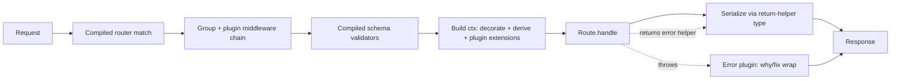

# Hyper — Design Document (v0, archived)

> **Status**: archived · historical record of the v0 design.
> The framework shipped in 0.1.0 closely matches this document, but this
> file is not kept strictly in sync. For the current surface area see:
>
> - [`/README.md`](../../README.md) — what you get today
> - [`/CHANGELOG.md`](../../CHANGELOG.md) — what shipped in 0.1.0
> - [`/docs/getting-started.md`](../getting-started.md) — hands-on intro
> - [`/docs/adr/`](../adr/) — decisions made along the way
>
> **Date**: 2026-04-23
> **One-line**: Hyper turns a typed TypeScript handler into a REST endpoint, a typed RPC, an MCP tool, and a wide-event observability span — simultaneously, with zero glue code.

## Table of contents

1. [Thesis & positioning](#1-thesis--positioning)
2. [Three pillars](#2-three-pillars)
3. [Route definition DX](#3-route-definition-dx)
4. [Handler signature, context, decoration](#4-handler-signature-context-decoration)
5. [Groups & composition](#5-groups--composition)
6. [Environment — layered](#6-environment--layered)
7. [Multi-protocol capabilities](#7-multi-protocol-capabilities)
8. [Resources, versioning, evolution](#8-resources-versioning-evolution)
9. [Plugin protocol](#9-plugin-protocol)
10. [Evlog as a reference plugin](#10-evlog-as-a-reference-plugin)
11. [TypeScript 7 & native toolchain](#11-typescript-7--native-toolchain)
12. [Runtime architecture & performance](#12-runtime-architecture--performance)
13. [Build pipeline](#13-build-pipeline)
14. [Distribution model](#14-distribution-model)
15. [CLI surface](#15-cli-surface)
16. [Dev-mode introspection](#16-dev-mode-introspection)
17. [v0 roadmap](#17-v0-roadmap)
18. [Open questions & risks](#18-open-questions--risks)

---

## 1. Thesis & positioning

Hyper is a Bun-first, AI-native API framework written in TypeScript. You write typed route handlers. The framework derives everything else at build time: the HTTP server, the typed client, the OpenAPI spec, the MCP tools, the observability spans, the error contracts.

One definition. Multiple surfaces. One wide-event log per request.

### What you write

```ts
route.post("/users")
  .body(CreateUserSchema)
  .handle(async ({ body, db, log }) => {
    if (await db.users.existsByEmail(body.email)) {
      return conflict({ code: "email_exists" })
    }
    log.set({ action: "user.create" })
    return created(await db.users.insert(body))
  })
```

### What you get, automatically

- `POST /users` HTTP endpoint, compiled to a monomorphic function at build time
- `create_user` MCP tool, discoverable by any AI agent (opt-in per route)
- `api.users.create()` typed RPC client, regenerated live in dev
- OpenAPI entry with correct status codes (201, 409) and inferred schemas
- Structured errors with `why` (root cause) and `fix` (action) fields
- Evlog wide-event log per request with validated body, duration, cache hits
- Contract test running under `hyper test` (from `.example()` metadata)
- Usable inside a React Server Action with one `.asServerAction()` helper

No plugins to wire. No middleware chain to compose. No OpenAPI glue. That handler is the whole API.

### The one-line pitch

Hyper turns a typed TypeScript handler into a REST endpoint, a typed RPC, an MCP tool, and a wide-event observability span — simultaneously, with zero glue code between them.

### Who it's for

- Teams building AI-native APIs that want MCP exposure without rewriting
- Bun-first greenfield projects that want the fastest native toolchain in 2026
- TypeScript maximalists tired of stitching Fastify + Zod + OpenAPI + Pino + tRPC
- Shops where agents are first-class API callers, not an afterthought

### Who it's not for

- Node-only codebases (Bun-only in v0; Node adapter deferred to v1)
- Teams without AI/agent use cases who value maximal minimalism (use Hono)
- Projects that require full decision freedom at every layer (use Hono + pick-your-own)

### How it compares

| | Hono | Elysia | Fastify | Next.js API | **Hyper** |
|---|---|---|---|---|---|
| Runtime | portable | Bun/Node | Node | Node/Edge | **Bun-first** |
| Router | runtime trie | runtime | runtime | file-based | **build-time compiled** |
| Route API shape | `new Hono().get(path, fn)` chain | `.get(path, fn)` chain | schema-driven object | file-based | **per-route value via builder** |
| Context | `c` with `c.json()` etc. | `c` / destructure | `request/reply` | `Request`/`Response` | **destructured ctx, no c.\*** |
| Env | `c.env` (Workers bindings) | `.env()` | plugins | `process.env` | **layered, typed, boot-validated** |
| Typed client | [Hono RPC](https://hono.dev/docs/guides/rpc) | [Eden](https://elysiajs.com/eden/overview) | no | no | **live codegen in dev** |
| OpenAPI | plugin | plugin | plugin | no | **always-on derivation** |
| MCP tools | no | no | no | no | **native, per-route opt-in** |
| Wide-event observability | BYO | BYO | BYO | no | **evlog default** |
| Structured errors (`why`/`fix`) | no | no | no | no | **first-class** |

Hono wins on portability and minimalism. Hyper wins when you're Bun-first and want one-import-one-way with every modern surface derived from the same source.

---

## 2. Three pillars

Every Hyper design decision reduces to one of three pillars. If a feature doesn't serve one of these, it doesn't ship.

### 2.1 Performance

Native-compiled everywhere in the inner loop — Bun (JSC, Zig) runtime, tsgo (Go) typechecker, Biome (Rust) linter/formatter, Bun bundler (Zig), `bun:test` (Zig). Zero JavaScript-based tools in the dev feedback cycle.

Build-time specialization: route matcher compiled to a `switch` statement + regex, validators compiled to monomorphic functions, static responses pre-serialized to buffers. Param-free routes routed at the Zig layer via `Bun.serve`'s native `routes` object before JS touches them.

Explicit targets in [§12](#12-runtime-architecture--performance). We publish numbers and fix code or claims, not both.

### 2.2 AI-native

Every route is optionally an MCP tool. `hyper dev` exposes the running app as a local MCP server so Cursor/Claude Code can introspect routes, schemas, recent requests, and invoke your code with real context. Errors carry `why` (root cause) and `fix` (action) fields that LLMs act on. Wide-event logs persist as NDJSON for agent replay.

This isn't marketing. Each of these is a concrete runtime or build-time feature referenced in specific sections below.

### 2.3 Humans

Opinionated where it matters, escapable everywhere else.

- One import path (`@usehyper/core`), one way to register a route (`route.<method>(path).handle(...)`), one way to return (data or helper).
- Errors readable without Googling (`{ status, message, why, fix, links }`).
- Shadcn-style CLI drops adapters, middleware, and client code into the user's repo. You own it. You edit it.
- Every structural decision justifies itself in one sentence; if it can't, it gets cut.

---

## 3. Route definition DX

The core primitive. Every other feature attaches to this.

### 3.1 The builder — 7 core methods, pure values

```ts
import { route, z } from "@usehyper/core"

const handler = route.<method>(pathLiteral)
  .params(schema?)     // optional — narrows path-inferred params
  .query(schema?)      // optional
  .body(schema?)       // optional
  .headers(schema?)    // optional — rarely used
  .env(schema?)        // optional — per-route env additions
  .meta(obj)           // plugin metadata; typed via RouteMeta augmentation
  .use(middleware)     // optional — route-local middleware (chainable)
  .handle(fn)          // finalize → frozen Route value
```

Verbs: `get`, `post`, `put`, `patch`, `delete`, `head`, `options`.

`route.<method>(path).handle(fn)` is the minimum. Every other method is optional.

Plus plugin-contributed fluent methods via declaration merging (all sugar over `.meta(...)`):

- `.throws({ 404: Schema, 409: Schema })` — declared error contract
- `.version("2024-01-15")` / `.version(2)` — API version
- `.deprecated({ since, removeIn, replaceWith })` — evolution tracking
- `.example({ input, output })` — contract test + OpenAPI example + agent few-shot
- `.idempotent({ header, ttl })` — Stripe-style idempotency
- `.cache({ key, ttl, swr })` — stale-while-revalidate
- `.rateLimit({ per, rpm })` — rate limiting
- `.slo({ p95, errorRate })` — SLO telemetry
- `.ws(branch)` — WebSocket upgrade branch
- `.asServerAction()` — emit a typed RSC server action wrapper

### 3.2 Path params inferred from the literal

```ts
route.get("/users/:id/posts/:postId")
  .handle(({ params }) => {
    // params: { id: string; postId: string }  — inferred from path, zero ceremony
  })
```

Template-literal types extract `:id` and `:postId` from the path at the type level. You only call `.params(z.object({ id: z.uuid() }))` when you want to narrow the type (string → UUID) or add runtime validation beyond "is a string".

### 3.3 Return helpers — status codes live at the return site

No `.returns(schema, { status })`. The handler's return type is the contract.

```ts
import { ok, created, accepted, noContent, redirect,
         notFound, conflict, unprocessable, unauthorized, forbidden,
         sse, stream, file, html, text } from "@usehyper/core"

route.post("/users")
  .body(CreateUser)
  .handle(async ({ body, db }) => {
    if (await db.users.existsByEmail(body.email)) {
      return conflict({ code: "email_exists" })         // 409 with typed body
    }
    const user = await db.users.insert(body)
    return created(user, { headers: { Location: `/users/${user.id}` } })  // 201
  })
```

Inference rules:

- Bare data (object, array, string, number) → 200 JSON (or `text/plain` for string)
- A `Response` instance → passthrough
- `AsyncIterable<T>` → streamed NDJSON automatically (`Transfer-Encoding: chunked`)
- Helper result (`created(x)`, `notFound(err)`) → typed `Response<Status, Body>`, flows into OpenAPI/MCP/client codegen

The handler's inferred return type is literally the OpenAPI `responses` map. No duplication.

### 3.4 Streaming, files, SSE

```ts
route.get("/events").handle(({ req }) =>
  sse(async function* () {
    for await (const event of source) yield { event: "update", data: event }
  })
)

route.get("/report.csv").handle(() =>
  stream(generateCSV(), { headers: { "Content-Type": "text/csv" } })
)

route.get("/download/:id").handle(({ params }) => file(`/uploads/${params.id}`))
```

`sse<EventMap>(...)` is typed — the generator's yield is constrained to the event map, which flows into the client's subscription types.

### 3.5 Errors — thrown vs returned

**Thrown**: unexpected. Uniformly handled by the error plugin. Structured with `why`/`fix` for humans and agents.

```ts
import { createError } from "@usehyper/core"

throw createError({
  status: 404,
  message: "User not found",
  why: "No user exists with that ID in the primary database",
  fix: "Verify the ID, or create the user first via POST /users",
  links: ["https://docs.example.com/errors/user_not_found"],
})
```

**Returned**: part of the contract. Typed, visible in the handler signature, surfaced in OpenAPI, client branches on it.

```ts
return notFound({ code: "user_not_found", hint: "check /users/search" })
```

**Rule of thumb**: if a client should branch on it, return it; if a client should retry or page an engineer, throw it.

**Declared throws** opt thrown errors into the contract:

```ts
route.get("/users/:id")
  .throws({ 404: UserNotFoundSchema })
  .handle(({ params, db }) => {
    const user = db.users.find(params.id)
    if (!user) throw userNotFound({ id: params.id })  // typed, in OpenAPI, in client union
    return user
  })
```

Undeclared throws become generic 500s with the standard `why`/`fix` shape.

### 3.6 Headers and cookies

Object form for static, chainable for conditional:

```ts
return created(user, {
  headers: { Location: `/users/${user.id}`, "X-Request-Id": ctx.requestId },
  cookies: { sid: { value, httpOnly: true, sameSite: "lax", maxAge: 3600 } },
})

// or
return created(user).header("X-Request-Id", id).cookie("sid", value, { httpOnly: true })
```

### 3.7 Why not other shapes?

Four candidate route APIs were considered. Scored against eight criteria:

| Criterion | Hono chain | Object config | tRPC procedure | **Fluent builder** |
|---|---|---|---|---|
| Path param inference from literal | yes (via chain generic) | awkward | n/a | **yes** |
| Grep-ability of path literal | yes | yes | no | **yes** |
| Composable across files | **no** (chain breaks) | yes | yes | **yes** |
| Colocated body+query+handler+meta | partial | yes | partial | **yes** |
| Testable without a server | hard | yes | yes | **yes** |
| Build-time introspection | hard | **yes** | yes | **yes** |
| No magic (decorators/filesystem) | yes | yes | yes | **yes** |
| Autocomplete guides you | weak | weak | medium | **strong** |

The builder wins because:

- **vs Hono chain**: chain types live in one `new Hono()` instance; splitting across files loses inference. Per-route values don't.
- **vs object config**: objects force TypeScript to resolve every key at once. Builder lets each call narrow the next, giving LSP-guided authoring.
- **vs tRPC procedure**: procedures model RPC, not HTTP. Verbs and paths are first-class here, not bolted on.
- **vs decorators / file-based**: no magic. The path literal is in the code; grep finds it.

### 3.8 The dumbest happy path

```ts
route.get("/health").handle(() => ({ ok: true }))
```

That is the entire route. 200 OK, JSON, typed.

---

## 4. Handler signature, context, decoration

### 4.1 The handler takes one context object

```ts
.handle(async ({
  params,    // path params (typed from path literal, refined by .params(...))
  query,     // URL query (typed from .query(...))
  body,      // request body (typed from .body(...))
  headers,   // request headers (typed from .headers(...))
  cookies,   // parsed cookies (lazy)
  req,       // the raw Request (escape hatch)
  env,       // merged, validated env (see §6)
  log,       // evlog wide-event builder (if @usehyper/evlog installed)
  user,      // auth subject (if @usehyper/auth-* installed)
  // ...plus anything from decorate / derive / plugins
}) => { ... })
```

One destructurable object. Pick only what you need. Plugins add fields via declaration merging. Tree-shaking is irrelevant because routes are build-time compiled.

No `c.json()`, no `c.status(400)`, no `c.header(...)`, no `c.set(...)`. Return values are responses.

### 4.2 Type inference sources, ranked

1. **Path literal** → `params` shape via template-literal types
2. **`.params(schema)`** → narrowed `params` (e.g. `string` → `UUID`)
3. **`.query(schema)`**, **`.body(schema)`**, **`.headers(schema)`** → typed fields
4. **App / group `.decorate(env => ({...}))`** → static ctx additions
5. **App / group / route `.derive(fn)`** → per-request ctx additions
6. **Plugin context extensions** → `ctx.log`, `ctx.user`, etc. via module augmentation
7. **`.env(schema)`** (app / group / route) → merged typed `env`

All merged into the final handler ctx type. TS 7 + tsgo makes this load tractable.

### 4.3 Context decoration — the "missing middle"

Between "ad-hoc imports in every route" and "write a plugin for a DB client", there's a third way: **decoration**.

#### 4.3.1 `decorate` — static, app-wide, env-driven

For DB clients, Redis, Stripe, any singleton instance:

```ts
// db.ts
import { drizzle } from "drizzle-orm/bun-sql"
export const db = drizzle(new Bun.SQL(process.env.DATABASE_URL!))
export type DB = typeof db

// app.ts
import { app } from "@usehyper/core"
import { db } from "./db"

export default app({
  env: {
    DATABASE_URL: z.string().url(),
    REDIS_URL: z.string().url(),
    STRIPE_KEY: z.string().startsWith("sk_"),
  },
  decorate: (env) => ({
    db,
    redis: createRedis(env.REDIS_URL),
    stripe: new Stripe(env.STRIPE_KEY),
  }),
  groups: [users, payments],
})
```

`decorate` is a **function of validated env**, not a literal object. This solves the chicken-and-egg problem (clients need env; env must validate first) and ensures decorations fail fast at boot if env is missing.

Decorations implementing `Symbol.asyncDispose` or `Symbol.dispose` are cleanly released on app shutdown (ES2023 explicit resource management; supported natively by TS 7 and Bun).

#### 4.3.2 `derive` — dynamic, per-request

For values computed from the incoming request or existing ctx:

```ts
const tenantRoutes = group("/tenants/:id")
  .derive(async ({ params, db }) => ({
    tenant: await db.query.tenants.findFirst({ where: eq(tenants.id, params.id) }),
  }))
  .add(
    route.get("/info").handle(({ tenant }) => tenant),     // tenant typed automatically
    route.patch("/").body(UpdateSchema).handle(({ tenant, body }) => ...),
  )
```

Works at app, group, or route level. Return shape flows into ctx via inference. Async-capable.

#### 4.3.3 Type propagation across files

Routes typically live in different files from `app.ts`. Use module augmentation for app-wide decorations:

```ts
// src/hyper.d.ts
import type { db } from "./db"
import type { Redis } from "ioredis"
import type Stripe from "stripe"

declare module "@usehyper/core" {
  interface AppContext {
    db: typeof db
    redis: Redis
    stripe: Stripe
  }
}
```

One declaration file, every route in the app sees `ctx.db` typed. Fastify's pattern; proven at scale.

For group-local `derive` additions, types flow through the builder chain into child routes without module augmentation.

#### 4.3.4 When to reach for a plugin instead

Use a plugin (not `decorate`/`derive`) when you need:

- Startup/shutdown hooks beyond `Symbol.asyncDispose`
- CLI subcommands
- Build-time artifact emission (OpenAPI, MCP, client codegen)
- Request lifecycle hooks (`before`, `after`, `onError`) for cross-cutting concerns (evlog, CORS, rate limiting)

`decorate` + `derive` cover ~90% of what users reach for plugins for in other frameworks.

### 4.4 Full example — Drizzle + Redis + evlog + auth

```ts
// src/routes/users.ts
import { route, group, z } from "@usehyper/core"
import { created, notFound } from "@usehyper/core"

export const users = group("/users").add(
  route.get("/:id").handle(async ({ params, db, redis, log }) => {
    const cached = await redis.get(`user:${params.id}`)
    if (cached) { log.set({ cacheHit: true }); return JSON.parse(cached) }

    const user = await db.query.users.findFirst({ where: eq(usersTable.id, params.id) })
    if (!user) return notFound({ code: "user_not_found" })

    await redis.set(`user:${params.id}`, JSON.stringify(user), "EX", 60)
    return user
  }),

  route.post("/")
    .body(z.object({ email: z.email(), name: z.string() }))
    .handle(async ({ body, db, log }) => {
      log.set({ action: "user.create" })
      const [user] = await db.insert(usersTable).values(body).returning()
      return created(user)
    }),
)
```

Clean route files. No imports of `db` or `redis`. Swappable for tests via `route.call({ db: mockDb, redis: mockRedis, ... })`.

---

## 5. Groups & composition

`group(prefix)` is the only composition primitive. Groups are values — import them, merge them, test them in isolation.

### 5.1 API

```ts
group(prefix: string)
  .use(middleware)                // route-local middleware
  .meta(obj)                      // merged into every child route's .meta
  .env(schema)                    // merged into every child route's env
  .decorate(fn)                   // static ctx additions for children
  .derive(fn)                     // per-request ctx additions for children
  .add(...routes: Route[])        // attach routes
  .merge(otherGroup)              // concatenate two groups
  .prefix(p)                      // change prefix (returns new group)
```

All methods return a new group; groups are immutable.

### 5.2 Nesting

```ts
const admin = group("/admin")
  .use(requireAdmin())
  .add(
    group("/users").add(listUsers, deleteUser),
    group("/billing").add(invoiceList, refundCreate),
  )
```

Nested groups inherit the parent's prefix, middleware, meta, env, and decorations.

### 5.3 Composition

```ts
import { v1 } from "./v1"
import { v2 } from "./v2"

const api = group("/api")
  .meta({ tag: "api" })
  .add(
    group("/v1").merge(v1),
    group("/v2").merge(v2),
  )
```

Each version tree lives in its own module. Mount them under `/api/v1` / `/api/v2` via one `app({ groups: [api] })`.

### 5.4 Testing

```ts
import { users } from "./routes/users"

test("GET /users/:id returns 404 for unknown", async () => {
  const res = await users.call("GET", "/123", { db: mockDb })
  expect(res.status).toBe(404)
})
```

Groups expose `.call(method, path, ctx?)` for in-process testing. No server, no network, no supertest.

---

## 6. Environment — layered

### 6.1 Three scopes, one merged shape

```ts
// App-level — the bulk of env lives here
app({
  env: {
    DATABASE_URL: z.string().url(),
    JWT_SECRET: z.string().min(32),
    NODE_ENV: z.enum(["development", "staging", "production"]),
    PORT: z.coerce.number().default(3000),
  },
  groups: [users, payments],
})

// Group-level — additions for a subtree
export const payments = group("/payments")
  .env({
    STRIPE_KEY: z.string().startsWith("sk_"),
    STRIPE_WEBHOOK_SECRET: z.string(),
  })
  .add(...)

// Route-level — additions for a single route
route.post("/webhooks/stripe")
  .env({ STRIPE_WEBHOOK_SIGNING_KEY: z.string() })
  .handle(({ env }) => {
    // env merged: DATABASE_URL, JWT_SECRET, NODE_ENV, PORT, STRIPE_KEY,
    //             STRIPE_WEBHOOK_SECRET, STRIPE_WEBHOOK_SIGNING_KEY
  })
```

Layers merge via intersection. `ctx.env` is typed with the merged shape per route.

### 6.2 Boot-time validation

`Bun.env` / `process.env` is read exactly once at app boot, parsed against the union of all schemas, frozen. On failure, the app exits with a formatted error listing every missing or invalid variable, following the evlog `why`/`fix` shape:

```
Env validation failed. The following variables must be fixed before the app can start:

  DATABASE_URL  (missing)
     why: required by app.ts
     fix: set DATABASE_URL in .env.local or your deployment secrets

  STRIPE_KEY  (invalid)
     why: must start with "sk_" (required by payments group)
     fix: use a secret key, not a publishable one (starts with "pk_")
```

Handlers never access `process.env` directly. If a handler needs env, it destructures `env` from ctx.

### 6.3 Secrets

Secret values are markable via schema metadata or helper:

```ts
env: {
  STRIPE_KEY: z.string().describe("secret"),        // via describe
  JWT_SECRET: secret(z.string().min(32)),           // via helper
}
```

Evlog auto-redacts marked values. `hyper env --print` masks them. Plugins that snapshot env for debugging honor the secret flag.

### 6.4 Plugins consume env at construction

```ts
app({
  env: { DATABASE_URL: z.string().url() },
  plugins: [
    dbPlugin({ url: (env) => env.DATABASE_URL }),
  ],
})
```

Plugins receive validated env as a function argument, not per-request. This makes env flow explicit, plugins pure, and tests trivial (pass a fake env to the plugin factory).

### 6.5 `useEnv()` escape hatch

For deep call stacks where threading `ctx.env` is painful:

```ts
import { useEnv } from "@usehyper/core"

function chargeCustomer(amount: number) {
  const env = useEnv()  // via AsyncLocalStorage
  return stripe(env.STRIPE_KEY).charge(amount)
}
```

Same data as `ctx.env`. Works inside any code called during a request.

### 6.6 `hyper env --check`

CI-safe command: loads your env source (`.env`, `.env.local`, platform secrets), validates against the merged schema, exits non-zero on failure with the same formatted error shape used at boot. Use in CI or pre-deploy checks.

---

## 7. Multi-protocol capabilities

A route is a **capability**, not an HTTP endpoint. One handler, multiple surfaces.

### 7.1 The four projections

Every Hyper route can be projected onto:

1. **HTTP** — the default. `POST /users` with JSON bodies, status codes, headers.
2. **Typed RPC** — `api.users.create(input)` generated as TypeScript. Uses HTTP under the hood but feels like a function call.
3. **MCP tool** — `create_user` exposed to AI agents via Model Context Protocol. Opt-in per route via `.meta({ mcp: { description, name? } })`.
4. **WebSocket** — opt-in via `.ws(branch)` for routes that upgrade to WebSocket.
5. **React Server Action** — `route.asServerAction()` returns a function compatible with RSC action dispatch.

The handler is written once. The framework projects it onto whatever surface the caller uses.

### 7.2 MCP tool exposure

```ts
route.post("/users")
  .body(CreateUserSchema)
  .meta({
    mcp: {
      description: "Create a new user with an email and display name. Returns the created user with their ID.",
    },
  })
  .handle(async ({ body, db }) => created(await db.users.insert(body)))
```

At build time, `@usehyper/mcp` emits a tool manifest: name, description, input schema, output schema, auth requirements. The `hyper mcp` command serves these as a real MCP server, authenticating the agent against the same plugins as HTTP.

Defaults are conservative: `mcp` is `false` per route unless the route explicitly opts in via meta. No route becomes an agent tool accidentally.

### 7.3 Typed RPC client

`hyper client <path>` emits a typed SDK into a workspace package:

```ts
// Generated ./packages/api-client/src/index.ts
export const api = {
  users: {
    create: (input: CreateUserInput) => Promise<Result<User, Conflict>>,
    get: (input: { id: string }) => Promise<Result<User, UserNotFound>>,
    list: (input?: { limit?: number }) => Promise<User[]>,
  },
  payments: { /* ... */ },
}
```

In dev, the client is **live-linked** — file changes on the server update the client's `.d.ts` within ~200ms (TS 7 speeds make this feasible). No manual `hyper client` run needed during development.

Error types flow through: routes with `.throws({ 404: UserNotFound })` return a `Result<T, UserNotFound>` on the client, forcing the caller to handle the documented error.

### 7.4 WebSocket branch

```ts
route.get("/live/prices")
  .ws({
    open: ({ send, query }) => { send({ type: "welcome" }); subscribe(query.symbol, send) },
    message: ({ data, send }) => handleClientMessage(data, send),
    close: ({ reason }) => cleanup(reason),
  })
```

WebSocket handlers share `decorate` / `derive` ctx with HTTP handlers. Same auth, same env, same log.

### 7.5 Subscription primitive (M2)

Beyond raw SSE, a typed subscription primitive for realtime data:

```ts
route.subscribe("/orders/:id")
  .events({
    updated: OrderSchema,
    cancelled: z.object({ reason: z.string() }),
  })
  .handle(async function* ({ params, db }) {
    for await (const evt of db.orders.watch(params.id)) yield evt
  })
```

Projects to:

- **REST** — Server-Sent Events at `GET /orders/:id`, event types typed in the client
- **RPC / tRPC subscription** — yields flow through the SSE link
- **MCP** — resource notifications (MCP's subscription equivalent)

One definition, three subscription surfaces.

### 7.6 React Server Action compatibility

```ts
// src/routes/users.ts
export const createUser = route.post("/users")
  .body(CreateUserSchema)
  .handle(async ({ body, db }) => created(await db.users.insert(body)))

// Anywhere in an RSC app:
import { createUser } from "@/server/routes/users"
const createUserAction = createUser.asServerAction()

// Use as a Next.js / React Router action
<form action={createUserAction}>...</form>
```

The same route serves HTTP + MCP + RPC + now RSC. Full-stack TypeScript projects get a single canonical definition.

---

## 8. Resources, versioning, evolution

APIs die from evolution. These primitives keep evolution first-class.

### 8.1 `route.resource()` — CRUD bundles

```ts
import { route, z } from "@usehyper/core"

export const users = route.resource("/users", {
  schema: UserSchema,
  schemas: {
    create: z.object({ email: z.email(), name: z.string() }),
    update: z.object({ name: z.string().optional() }).partial(),
  },
  list:   async ({ query, db })        => db.users.list(query),
  get:    async ({ params, db })       => {
    const user = await db.users.find(params.id)
    return user ?? notFound({ code: "user_not_found" })
  },
  create: async ({ body, db })         => created(await db.users.insert(body)),
  update: async ({ params, body, db }) => db.users.update(params.id, body),
  delete: async ({ params, db })       => {
    await db.users.delete(params.id)
    return noContent()
  },
})
```

Generates 5 routes with correct status codes, `Location` headers on create, 404 semantics on missing resources, OpenAPI tags, and 5 MCP tools (opt-in via meta). Each operation remains a standalone `Route` value you can override or extend.

### 8.2 `.version()` — semantic or date-based

```ts
// Stripe-style date-based (recommended for externally-facing APIs)
route.get("/users")
  .version("2024-01-15")
  .handle(({ db }) => db.users.listV1())

route.get("/users")
  .version("2024-06-01")
  .handle(({ db }) => db.users.listV2())

// Or semantic
route.get("/users").version(1).handle(...)
route.get("/users").version(2).handle(...)
```

Globally configurable routing mode:
- `Accept-Version` header (Stripe/Twilio-style)
- URL prefix (`/v1/users`, `/v2/users`)
- Either (fall back from header to prefix)

### 8.3 `.deprecated()` — visible in every surface

```ts
route.get("/users")
  .version("2024-01-15")
  .deprecated({
    since: "2024-06-01",
    removeIn: "2025-01-15",
    replaceWith: "GET /users @ 2024-06-01",
    reason: "Returns legacy shape; v2 returns paginated results",
  })
  .handle(...)
```

Effects:

- OpenAPI entry marked `deprecated: true` with rationale
- Client codegen emits `@deprecated` JSDoc so IDEs surface warnings
- Every request to a deprecated route logs a structured deprecation event
- `Sunset` header automatically added per RFC 8594

### 8.4 `.example()` — one primitive, four uses

```ts
route.post("/users")
  .body(CreateUser)
  .example({
    name: "creates a new user",
    input: { body: { email: "ada@example.com", name: "Ada Lovelace" } },
    output: { status: 201, body: { id: "u_abc", email: "ada@example.com", name: "Ada Lovelace" } },
  })
  .example({
    name: "rejects duplicate email",
    input: { body: { email: "ada@example.com", name: "Ada" } },
    output: { status: 409, body: { code: "email_exists" } },
  })
  .handle(...)
```

Consumed by:

- `hyper test` — runs each example as a contract test
- OpenAPI — includes inputs/outputs as named examples
- MCP tool descriptions — passed to agents as few-shot examples
- Generated client JSDoc — shown in IDE hover

### 8.5 Reliability primitives as meta

These are plugin-implemented but feel first-class:

```ts
// Stripe-style idempotency
route.post("/payments")
  .idempotent({ header: "Idempotency-Key", ttl: "24h" })
  .body(PaymentSchema)
  .handle(async ({ body, stripe }) => created(await stripe.charge(body)))

// Stale-while-revalidate HTTP caching
route.get("/feed")
  .cache({ key: ({ user }) => `feed:${user.id}`, ttl: "30s", swr: "5m" })
  .handle(async ({ user, db }) => db.feed.for(user.id))

// Rate limiting
route.post("/login")
  .rateLimit({ per: "ip", rpm: 10 })
  .body(LoginSchema)
  .handle(...)

// SLO declaration
route.get("/search")
  .slo({ p95: 100, errorRate: 0.001 })
  .handle(...)
```

Idempotency, caching, rate-limit, SLO — each is a separate plugin that reads its meta key. Install none of them if you don't need them.

---

## 9. Plugin protocol

Plugins are how you extend Hyper without bloating core.

### 9.1 Shape

```ts
import { definePlugin } from "@usehyper/core"

export function myPlugin(config: MyConfig = {}) {
  return definePlugin({
    name: "my-plugin",

    // Startup: runs once when the app boots, after env validation
    async start({ env, app }) {
      // connect to external services, load data, etc.
    },

    // Shutdown: runs on app exit
    async stop() { /* cleanup */ },

    // Build-time: emit artifacts during hyper build
    build({ routes, emit }) {
      emit("my-output.json", JSON.stringify(spec))
    },

    // Runtime: mount additional routes (e.g. /docs, /openapi.json)
    routes() {
      return [
        route.get("/my-plugin/health").handle(() => ({ ok: true })),
      ]
    },

    // Runtime: per-request lifecycle hooks
    request: {
      before(ctx) { /* augment ctx, etc. */ },
      after(ctx, res) { /* post-process */ },
      onError(ctx, err) { /* map errors */ },
    },

    // Typed context extensions (merged via declare module)
    context: {} as { myValue: string },

    // Typed RouteMeta extensions (so .meta({ myKey: ... }) autocompletes)
    meta: {} as { myKey?: { option: string } },

    // CLI subcommands (exposed as `hyper my-plugin:<cmd>`)
    cli: {
      "my-plugin:sync": {
        description: "Sync with external service",
        handler: async ({ env }) => { /* ... */ },
      },
    },

    // Fluent builder methods added via declaration merging
    // (see §9.3)
  })
}
```

### 9.2 Plugin ordering

Plugins registered in `app({ plugins: [...] })` run in array order for:

- `start` (serial by default; plugins can declare `parallel: true`)
- `request.before` (first registered runs first)
- `request.after` (reverse order — last registered runs first, symmetric with `before`)
- `request.onError` (first registered wins; later plugins can re-throw to continue)

Plugin dependencies declared via `requires: ["evlog"]` — app fails to start if a required plugin is absent.

### 9.3 Fluent builder extensions

Plugins extend the route builder with sugar methods via TypeScript declaration merging:

```ts
// Inside @usehyper/auth-jwt
declare module "@usehyper/core" {
  interface RouteBuilder<C, B> {
    auth(role: "user" | "admin"): this
  }
}

// User code
route.post("/admin/purge")
  .auth("admin")        // added by @usehyper/auth-jwt
  .rateLimit({ rpm: 1 }) // added by @usehyper/rate-limit
  .handle(...)
```

All sugar methods are shorthand for `.meta({ auth: ..., rateLimit: ... })`. They exist only for DX — the underlying data model is the meta object.

### 9.4 tRPC v11 as a plugin — effortless coexistence

```ts
import { app } from "@usehyper/core"
import { trpc } from "@usehyper/trpc"
import { appRouter } from "./trpc/router"

export default app({
  groups: [users, posts],
  plugins: [
    evlog(),
    trpc({
      router: appRouter,
      path: "/trpc",
      createContext: (ctx) => ctx,  // Hyper ctx → tRPC ctx (same object)
    }),
  ],
})
```

What this gets you:

- tRPC procedures mounted under `/trpc/*` via tRPC's WinterCG fetch adapter, running on Bun.serve with no intermediate HTTP layer
- **Shared context**: procedures receive the full Hyper ctx (`ctx.log`, `ctx.env`, `ctx.user`, `ctx.db`, …)
- **Middleware interop**: `@usehyper/auth-jwt` authenticates tRPC procedures without tRPC-specific wiring; helpers `toTrpcMiddleware(hyperMw)` and `toHyperMiddleware(trpcMw)` bridge the other direction
- **Error bridge**: tRPC errors are wrapped in `{ why, fix }` so tRPC and REST errors look identical in logs
- **Schema reuse**: both `procedure.input(schema)` and `route.body(schema)` accept Standard Schema — share Zod/Valibot/ArkType schemas
- **Shared subscriptions**: tRPC v11 SSE subscriptions run through Hyper's streaming infrastructure
- **Optional projection**: `procedure.meta({ mcp: true, openapi: true })` exposes procedures as MCP tools and in the OpenAPI spec, identical to Hyper routes
- **Migration helpers**: `trpcToHyper(procedure, { method, path })` converts a single procedure into a Hyper route

tRPC's client-side ecosystem (`@trpc/react-query`, links, batching) works unchanged. Hyper's typed client continues to cover Hyper routes. Both coexist in one app without overlap.

### 9.5 Core exports only what plugins need

`@usehyper/core` exports:

- `app`, `route`, `group`, `createError`, return helpers (`ok`, `created`, …), Standard Schema glue
- `definePlugin` and the plugin types
- Context accessors (`useLog`, `useEnv`, `useRequest`)
- Nothing else

Every other feature — logging, OpenAPI, MCP, auth, CORS, rate limiting, caching, tRPC bridge — is a plugin package. Core stays small.

---

## 10. Evlog as a reference plugin

`@usehyper/evlog` demonstrates the plugin protocol end-to-end. It is not part of core. If you don't install it, `ctx.log` doesn't exist and routes simply don't log.

### 10.1 What it adds

```ts
import { app } from "@usehyper/core"
import { evlog, createAxiomDrain } from "@usehyper/evlog"

export default app({
  plugins: [
    evlog({
      drain: createAxiomDrain({ dataset: "api" }),
      sampling: {
        rates: { info: 10, warn: 50, error: 100 },
        keep: [{ status: 400 }, { duration: 1000 }, { path: "/api/critical/**" }],
      },
      redact: ["body.password", "headers.authorization"],
    }),
  ],
  groups: [...],
})
```

### 10.2 Route-level usage

```ts
route.post("/checkout")
  .body(CheckoutSchema)
  .handle(async ({ body, db, stripe, log }) => {
    log.set({ user: { id: body.userId, plan: body.plan } })
    log.set({ cart: { items: body.items.length, total: body.total } })

    const charge = await stripe.charge(body.total)
    log.set({ stripe: { chargeId: charge.id } })

    if (!charge.success) {
      throw createError({
        status: 402,
        message: "Payment failed",
        why: charge.decline_reason,
        fix: "Try a different payment method",
      })
    }
    return { orderId: charge.id }
  })
```

One wide event per request. Accumulated context. One log line emitted at the end with everything.

### 10.3 How the plugin wires in

- **Context extension**: `ctx.log` typed via `declare module "@usehyper/core"`
- **Request hooks**: `before` creates a fresh log builder; `after` emits it; `onError` merges error fields before emission
- **Error wrapping**: catches `createError`, ensures `why`/`fix` are on the output; catches uncaught throws and wraps them with generic `{ why: "Uncaught", fix: "add try/catch near the origin" }`
- **Secret redaction**: reads the env schema's secret markers, plus the plugin's `redact` config, and masks before drain
- **AI SDK integration**: `ctx.ai.wrap(model)` auto-tracks tokens, tool calls, cost into the wide event (see [evlog AI docs](https://www.evlog.dev/))

### 10.4 Local NDJSON drain for agents

In dev, evlog writes one NDJSON line per request to `.hyper/logs/<date>.ndjson`. Cursor / Claude Code can tail or read this file directly — every request is fully described, errors include `why`/`fix`, and the log id lets agents replay the specific request via the dev MCP server.

---

## 11. TypeScript 7 & native toolchain

### 11.1 Target and installation

- **Now**: `@typescript/native-preview@beta` (TS 7.0 beta, released 2026-03-23)
- **At stable (~June 2026)**: `typescript@7` via `tsc`
- **Install**: `bun add -d @typescript/native-preview@beta`
- **Run**: `tsgo --noEmit --pretty` (will become `tsc` at stable)

TS 7 is semantically identical to TS 6. It is a Go rewrite of the compiler for ~10× speed via shared-memory parallelism. No new syntax, no new type features — just dramatically faster checking and editor interaction.

### 11.2 Why this matters for Hyper

TS 7 unblocks the design's heaviest inference load: plugin-participating context extensions, per-route meta type merging, deeply typed handler signatures. At TS 6 speeds, a 500-route app with 10 plugins hits compile times of 30+ seconds in cold runs; at TS 7 speeds, seconds. The "live typed client" feature — regenerating client `.d.ts` on every route change — becomes viable below the perception threshold (~200ms).

### 11.3 tsconfig baseline

```json
{
  "compilerOptions": {
    "target": "ES2023",
    "module": "preserve",
    "moduleResolution": "bundler",
    "strict": true,
    "noUncheckedIndexedAccess": true,
    "exactOptionalPropertyTypes": true,
    "verbatimModuleSyntax": true,
    "isolatedDeclarations": true,
    "allowImportingTsExtensions": true,
    "noEmit": true,
    "skipLibCheck": true,
    "types": ["@types/bun"]
  }
}
```

`isolatedDeclarations: true` is a deliberate pick. It forces explicit return types on public APIs, which:

- Speeds up IDE hover and go-to-definition
- Makes Hyper's `.d.ts` emission feasible via Bun/tsgo without full-program emit (which is limited in the TS 7 beta)
- Catches implicit-any drift in public plugin APIs

### 11.4 Route-tree introspection strategy

TS 7's stable programmatic API is not available until TS 7.1 (several months after 7.0 stable). Hyper does not wait.

**Decision**: route-tree introspection uses a **runtime metadata graph**, not the TypeScript compiler API. Each `.handle()` call finalizes a `Route` value with its own typed metadata (path, method, schemas, meta, decorate, derive). Plugins walk this object graph at build time.

This has independent benefits beyond TS 7 timing:

- Introspection works without a tsconfig present
- Testing introspection logic is a plain unit test
- The metadata graph is language-agnostic — a future Rust or Go port could emit equivalent JSON

### 11.5 Toolchain

```
Runtime           Bun            (Zig, JavaScriptCore)
Typecheck         tsgo           (Go)
Bundler           Bun            (Zig)
Test runner       bun:test       (Zig)
Format / lint     Biome          (Rust)
Package manager   Bun            (Zig)
```

Every tool in the inner loop is natively compiled. Nothing JavaScript-based runs during a dev iteration. This isn't an aesthetic preference; it's what makes `hyper dev` feel instantaneous on large apps.

---

## 12. Runtime architecture & performance

### 12.1 Request lifecycle



Every arrow is measured. Overhead budgets in §12.5.

### 12.2 Router

**Dev mode** — radix/trie router, rebuilt on file change. Optimized for low-latency rebuild, not max throughput.

**Build mode** — `hyper build` walks the route metadata graph and emits:

1. A **monomorphic per-route function**: parser + validator + middleware + handler + serializer inlined. No runtime dispatch; JSC keeps each function's call sites monomorphic.
2. A **switch-statement matcher** keyed on method + first path segment, falling through to a compiled regex set for param routes. Cold-path-free for the common case.
3. **Bun.serve `routes` object** for every param-free route. Bun matches these in Zig before JS runs, shaving ~300ns per request.

Crossover rule: param-free → Bun-native `routes`; parameterized → compiled JS switch; complex patterns (regex, wildcards) → compiled regex.

### 12.3 Validators — compiled

At build time, each Standard Schema on a route becomes a single monomorphic validate function via the schema library's compile-to-code facility (Zod v4 emit, Valibot's compiled mode, ArkType's compiled validator). No schema-walk per request.

Dev mode falls back to the schema's runtime validate; build mode inlines.

### 12.4 Zero-allocation hot path

Techniques used in the compiled output to minimize per-request allocation:

- **Pooled context objects** reset per request (no `{}` per req). Context shape is consistent for JSC monomorphic caching.
- **Lazy proxies** for `headers`, `cookies`, `query` — parsed on first access, memoized.
- **Pre-serialized static responses** — if a route's return type is a compile-time-constant shape, the JSON string is emitted as a `Buffer` at build; the handler returns that buffer directly.
- **AsyncLocalStorage always on** — Bun 1.1+ made it near-free. Used for `useLog()`, `useEnv()`, `useRequest()`. Documented cost: ~5ns/req.
- **Streaming by default for `AsyncIterable` returns** — no buffering large responses in memory.

### 12.5 Performance targets (v0)

These are the numbers Hyper commits to. Benchmarks run on M-series Bun on Linux, published under `hyper bench` with reproducible scripts.

| Metric | Target | Notes |
|---|---|---|
| Simple GET, no validation | ≥ 1.8M req/s | > 1.5× Hono on Bun |
| POST with Zod body (5 fields) | ≥ 700K req/s | Validators compiled |
| p999 latency (trivial route) | < 2ms | Full stack, local |
| Memory retained per in-flight req | < 8KB | Pooled ctx |
| Cold start (Bun startup + first response) | < 30ms | Static route, compiled build |
| Core runtime bundle | < 30KB gzipped | `@usehyper/core` only |
| Second-run `hyper dev` startup | < 200ms | Content-hash build cache |

If we miss a target, we fix the code. If we can't fix the code, we change the claim. No fudging.

### 12.6 Binary wire format negotiation

`Accept` / `Content-Type` drives serialization:

- `application/json` (default)
- `application/msgpack` (via `@usehyper/msgpack`, negotiated automatically with the typed client)
- `application/cbor` (via `@usehyper/cbor`)

Internal service-to-service traffic using the typed client negotiates MessagePack by default, ~2-5× smaller payloads, ~2× faster serialize. Handler code unchanged.

### 12.7 HTTP/2 and HTTP/3

Bun.serve handles h2 and QUIC transparently in recent versions. Hyper doesn't fight it; the framework's internal protocol is the WinterCG fetch handler signature `(req: Request) => Promise<Response>`, which is protocol-agnostic.

---

## 13. Build pipeline

### 13.1 `hyper build` stages

```
1. tsgo validate  (parallel)    → type errors fail the build
2. Route graph    (parallel)    → walk route values, emit .hyper/routes.json
3. Validator compile            → Standard Schema → inlined TS per route
4. Bundle                       → Bun bundle server + emit per-route monomorphic fns
5. Plugin build hooks            → OpenAPI, MCP manifest, client SDK, etc.
6. Pre-serialize static         → emit buffer blobs for constant responses
7. d.ts emit                    → via isolatedDeclarations (tsgo or Bun)
```

Steps 1 and 2 run in parallel (tsgo doesn't need the route graph; route graph doesn't block on type errors).

### 13.2 Outputs

```
dist/
├── server.js            # single bundled server, Bun-runnable
├── routes.json          # canonical route graph (schemas serialized)
├── openapi.json         # emitted by @usehyper/openapi
├── mcp-manifest.json    # emitted by @usehyper/mcp
├── client/              # emitted by @usehyper/client (typed SDK, tsup output)
│   ├── index.js
│   └── index.d.ts
└── meta.json            # build metadata: versions, timings, targets
```

### 13.3 Content-hash build cache

`hyper build` keys each stage's output on the hash of its inputs. Stored under `.hyper/cache/`. On a rebuild:

- Unchanged route files → reuse compiled validators
- Unchanged plugin list → reuse OpenAPI/MCP/client artifacts
- Only changed files hit the full pipeline

Effect: `hyper dev` second-run startup < 200ms, even on apps with hundreds of routes.

### 13.4 `hyper dev`

Runs `bun --hot` for the server + `tsgo --noEmit --watch` for type checking in parallel. Routes hot-swap without losing decorate state (stopgap caveat: if `decorate` construction changes, the whole app restarts). Logs stream to `.hyper/logs/`. Dev MCP server binds at `localhost:<port>/.hyper/mcp`.

---

## 14. Distribution model

### 14.1 Hybrid: packages + copied files

**Packages** are everything with versioning-as-a-product — core runtime, typechecking dependencies, OpenAPI emitter. Shipped via npm under `@usehyper/*`. Updated via `bun update`.

**Copied files** are everything users want to fork — adapters, auth middleware, session stores, error handlers, scaffolding. Shipped via the `hyper add` CLI command into the user's own repo. Updated via a `hyper diff` command that shows drift from the registry version.

The split mirrors shadcn/ui's model, adapted to API frameworks where core inference machinery must stay versioned.

### 14.2 Naming convention (locked)

- **npm scope**: `@usehyper/*` for every official package
- **CLI binary**: `hyper` (exported by `@usehyper/cli`)
- **Runs via**: `bunx hyper <cmd>` or (installed) `hyper <cmd>`
- **Module augmentation target**: `declare module "@usehyper/core"`
- **User imports**: always scoped (`@usehyper/<pkg>`), never bare

### 14.3 Official packages

| Package | Purpose |
|---|---|
| `@usehyper/core` | Route builder, group, app, context types, return helpers, error primitives, plugin protocol, hooks (`useLog`, `useEnv`, `useRequest`) |
| `@usehyper/cli` | The `hyper` binary — `init`, `add`, `dev`, `build`, `routes`, `typecheck`, `openapi`, `mcp`, `client`, `bench`, `env`, `test` |
| `@usehyper/evlog` | Reference plugin — wide events, `why`/`fix`, AI SDK wrapper, drains |
| `@usehyper/openapi` | OpenAPI emitter + Swagger UI route |
| `@usehyper/mcp` | MCP server plugin (app-as-tools) |
| `@usehyper/trpc` | tRPC v11 bridge |
| `@usehyper/auth-jwt` | JWT auth middleware |
| `@usehyper/session` | Session middleware |
| `@usehyper/rate-limit` | Rate limiting (consumes `.rateLimit()` meta) |
| `@usehyper/idempotency` | Idempotency (consumes `.idempotent()` meta) |
| `@usehyper/cache` | HTTP caching (consumes `.cache()` meta) |
| `@usehyper/cors` | CORS |
| `@usehyper/otel` | OpenTelemetry + `.slo()` integration |
| `@usehyper/db` | Opinionated `Bun.sql` wrapper with evlog query events |
| `@usehyper/drizzle`, `@usehyper/prisma` | Pre-configured `decorate` helpers |
| `@usehyper/client` | Runtime helpers for the generated typed client |
| `@usehyper/msgpack`, `@usehyper/cbor` | Binary wire format plugins |
| `create-hyper` | `bunx create-hyper@latest` scaffolder (unscoped per npm convention) |

### 14.4 Shadcn-style copied files

Installed via `hyper add <ref>` into the user's repo:

- **Adapters**: `bun`, `node`, `workers`, `vercel`, `aws-lambda`
- **Scaffolding**: `tsconfig.json`, `biome.json`, `.hyper/config.ts`
- **Fork-prone middleware**: `auth-jwt`, `session`, custom error handlers
- **Generated typed client output**: `./packages/api-client/`
- **Error handler template**: `src/errors.ts`
- **Example routes** in starter templates

### 14.5 Registry

Hosted at `registry.hyper.dev/r/<ref>.json` (placeholder). Each registry entry declares:

```json
{
  "name": "middleware/auth-jwt",
  "description": "JWT authentication middleware",
  "version": "1.0.0",
  "files": [
    { "path": "src/middleware/auth-jwt.ts", "url": "..." },
    { "path": "src/middleware/auth-jwt.test.ts", "url": "..." }
  ],
  "dependencies": { "@usehyper/core": "^1.0.0", "jose": "^5.0.0" },
  "postInstall": "hyper env --check"
}
```

`hyper add middleware/auth-jwt` fetches, writes files into the user's repo, updates `package.json`, and runs any post-install command.

---

## 15. CLI surface

```
hyper init [--template=minimal|api|ai|full]
hyper add <ref>                 # drop shadcn-style files into the repo
hyper dev                       # Bun --hot + tsgo --watch, NDJSON logs, dev MCP server
hyper build                     # full production build
hyper routes                    # print all routes, schemas, meta
hyper typecheck                 # wrap tsgo --noEmit
hyper openapi [--emit <path>]   # print or emit OpenAPI spec
hyper mcp                       # serve app as an MCP server (prod)
hyper client <path>             # regenerate typed SDK into a workspace package
hyper bench <path>              # per-route load test (reports vs targets)
hyper env [--check]             # print or validate merged env schema
hyper test                      # runs .example() contract tests + bun:test
hyper diff [<ref>]              # show drift of copied files vs registry
```

Each plugin can register additional `hyper <plugin>:<cmd>` subcommands via its `cli` hook.

Every command emits structured (JSON) output when run with `--json`, for agent consumption.

### 15.1 Templates

- `--template=minimal` — core + one route, no plugins
- `--template=api` — core + evlog + openapi + cors + otel, typical REST app
- `--template=ai` — core + evlog + mcp + `ai`-sdk helpers, agent-backend app
- `--template=full` — everything, for exploring the framework

Each template is just a preconfigured `app({ plugins: [...] })`. Users see what's on and can remove anything.

---

## 16. Dev-mode introspection

### 16.1 NDJSON wide-event logs

`hyper dev` writes every request's wide event (via evlog, if installed) to `.hyper/logs/<date>.ndjson`. Cursor / Claude Code / other agents tail this file directly. Every event includes:

- `requestId` (UUID, returned in `X-Request-Id` response header)
- `method`, `path`, `route` (template), `status`, `duration`
- Full validated `body`, `query`, `params` (with redacted secrets)
- `user` context if authenticated
- `why`/`fix` if an error was thrown or returned
- Evlog's accumulated `.set()` calls

### 16.2 Dev MCP server

`hyper dev` binds a local-only MCP server at `/.hyper/mcp`. An agent connecting to it can:

- **List routes** — with full schemas, meta, version, deprecation status
- **Get recent requests** — last N wide events, with full request/response
- **Get recent errors** — last N thrown or returned errors, grouped by `why`
- **Invoke a route** — call any route as an MCP tool with typed args, get the real response
- **Replay a request** — re-run a specific logged request to reproduce a bug

This is the most novel primitive in the framework. It turns the running dev server into a real-time knowledge base for AI tools.

### 16.3 Security

- Dev MCP server binds only to `127.0.0.1` / `::1`
- Disabled entirely in `hyper build` output
- Routes with `meta.internal: true` never exposed, even in dev
- `meta.mcp: false` explicitly blocks a route from the MCP surface

---

## 17. v0 roadmap

Milestones are ordered by value: each milestone builds a usable subset.

### M0 — Skeleton (proves type inference end-to-end)

- `app()`, `route`, `group` core builder
- `GET` method (one verb, to start)
- Compiled router (dev-mode trie only)
- Bun adapter (copied file)
- `route.call(...)` for in-process testing
- One passing test: type inference from `.body(z.object({}))` into handler

**Exit criteria**: can write a trivial GET route, run it on Bun, invoke it in a `bun:test` via `.call()`.

### M1 — Usable (real apps can ship against it)

- All HTTP methods
- Groups with `.use` / `.meta` / `.env` / `.decorate` / `.derive` / `.add` / `.merge`
- Layered env system with boot validation
- All return helpers
- `createError` + thrown/returned error semantics
- `@usehyper/evlog` reference plugin
- `hyper dev` / `hyper build` / `hyper typecheck` CLI
- Example app in `examples/`

**Exit criteria**: a small real app (`examples/todo`) runs in production-shaped build.

### M2 — Modern (the differentiators)

- Multi-protocol projection — typed RPC client codegen
- `@usehyper/mcp` plugin + `hyper mcp` CLI
- `route.resource()` CRUD bundles
- `.version()` + `.deprecated()` + `.throws()` + `.example()`
- Live typed client in dev (file watcher writes `.d.ts` to linked workspace)
- `@usehyper/trpc` — tRPC v11 integration plugin
- `hyper test` contract tests
- `@usehyper/drizzle` / `@usehyper/prisma` adapters

**Exit criteria**: an example app exposes itself as both REST and MCP, and agents successfully invoke routes.

### M3 — Production (reliability, ecosystem, shadcn CLI)

- `@usehyper/openapi` + `/docs` UI route
- `@usehyper/idempotency`, `@usehyper/cache`, `@usehyper/rate-limit`
- `@usehyper/otel` with `.slo()` integration
- `@usehyper/cors`, `@usehyper/auth-jwt`, `@usehyper/session`
- Dev-mode app-as-MCP-server
- Binary wire format negotiation (`@usehyper/msgpack`)
- Subscription primitive (`route.subscribe()`)
- `@usehyper/db` (Bun.sql wrapper with evlog query logs)
- `@usehyper/rsc` server action compat
- Shadcn-style CLI + public registry

**Exit criteria**: performance targets from §12.5 hit in published benchmarks; v1.0 release-candidate ready.

### v1 — Reserved

- Durable / resumable handlers (`route.workflow()`)
- Schema-first import (`hyper import openapi.yaml`)
- Feature-flag variant routing
- Node runtime adapter
- Cloudflare Workers adapter
- Background jobs primitive (`job()` — Bun worker threads in dev, queue adapter in prod)

### Explicit non-goals (v0)

- Node runtime support (adapter deferred to v1; Bun-only in v0)
- Cloudflare Workers adapter (v1)
- Decorator-based APIs (never — hide behavior, hurt grep, require legacy TS flags)
- GraphQL as core (plugin territory if anyone wants it)
- tRPC-style "queries" vs "mutations" distinction (HTTP verbs already encode this)
- Effect-TS as a required primitive (optional interop plugin at most)
- Full Convex / Jazz-style reactive DB (different thesis)

---

## 18. Open questions & risks

### 18.1 Naming

- `@usehyper/*` npm scope availability — must be verified before first publish. If unavailable, fallbacks: `@hypernative`, `@hyperdev`, `@zap`, `@edge-api`, `@jet`, or rebrand entirely. Name check is a v0-ship concern, not a design-doc concern.
- Framework name conflict risk (the word "hyper" is heavily used). Consider a distinctive secondary handle for discoverability.

### 18.2 MCP-export security

- Default `mcp: false` per route, explicit opt-in via `.meta({ mcp: { description } })` is the right posture.
- Dev MCP server is localhost-only and disabled in prod builds, but document the threat model explicitly: any route exposed as an MCP tool inherits its HTTP auth but has a different attack surface (tool descriptions, parameter fuzzing by agents).
- Ship a `hyper mcp --audit` CLI that lists every exposed tool with its auth requirements, so it can be reviewed before each release.

### 18.3 Evlog version pinning

- Tying core error semantics to `@usehyper/evlog` creates a supply-chain coupling. Mitigation: Hyper re-exports `createError` under its own surface; if evlog's wire format changes, we absorb the break in `@usehyper/evlog` without touching `@usehyper/core`.
- Evlog itself is young. We pin an exact minor version in v0 and validate compatibility per upgrade.

### 18.4 TS 7 programmatic API timing

- Stable programmatic API not available until TS 7.1 (~months after 7.0 stable).
- **Mitigated** by the runtime metadata graph decision in §11.4 — Hyper's introspection doesn't depend on the TS API at all.
- If a user plugin wants to walk TypeScript types, it can still use the classic TS 6 programmatic API via `@typescript/typescript6` until 7.1 ships. Document this.

### 18.5 Bun-only footprint

- Cuts us off from ~90% of the JS server market. Conscious trade for 2× perf, simpler design, faster toolchain.
- Node adapter in v1 unblocks the rest, but requires care: AsyncLocalStorage has higher cost on Node historically, and some Bun-specific APIs (`Bun.sql`, `Bun.password`) would need adapters or community replacements.

### 18.6 Registry hosting

- The shadcn-style registry needs a hosted JSON manifest + CDN for file distribution. Options: Cloudflare Pages, Vercel, self-hosted with S3 + CloudFront.
- Registry entries should be content-hashed (integrity) and signed (provenance) so `hyper add` can verify before writing.

### 18.7 Type inference cost at scale

- Even with TS 7, plugin-participating inference could hit pathological cases (e.g. 30 plugins × 500 routes with deep unions). Plan: prototype a worst-case app early (during M1) and verify compile times stay under 5s cold, 500ms incremental.
- Fallback: explicit generic typing (`app<{ Variables: {...} }>()` Hono-style) as an opt-out if inference load becomes a problem.

### 18.8 Shadcn CLI drift management

- Users edit copied files; registry updates produce conflicts. `hyper diff` shows three-way drift (user version, original copied version, latest registry version). No auto-merge in v0 — user resolves manually.
- Long-term: consider a `// @hyper:preserve` comment convention so updates can patch around user-edited regions.

### 18.9 Live typed client — hot-link mechanics

- Writing to `node_modules` of a client app is fragile (pnpm stores, workspaces, monorepos).
- Preferred path: generate into a workspace package (`./packages/api-client/`) that the client app imports via workspace protocol. Updates propagate via `tsgo --watch` or Turbopack/Vite HMR.
- Document required repo layout for this to work (monorepo with a client workspace).

---

## Appendix A — worked full example

```ts
// src/db.ts
import { drizzle } from "drizzle-orm/bun-sql"
export const db = drizzle(new Bun.SQL(process.env.DATABASE_URL!))
export type DB = typeof db

// src/hyper.d.ts
import type { db } from "./db"
declare module "@usehyper/core" {
  interface AppContext {
    db: typeof db
  }
}

// src/routes/users.ts
import { route, group, z, created, notFound, conflict } from "@usehyper/core"

const UserSchema = z.object({
  id: z.uuid(),
  email: z.email(),
  name: z.string(),
})
type User = z.infer<typeof UserSchema>

export const users = group("/users")
  .meta({ tag: "users" })
  .add(
    route.get("/:id")
      .throws({ 404: z.object({ code: z.literal("user_not_found") }) })
      .example({
        name: "gets an existing user",
        input: { params: { id: "u_abc" } },
        output: { status: 200, body: { id: "u_abc", email: "a@b.com", name: "Ada" } },
      })
      .handle(async ({ params, db, log }) => {
        const user = await db.query.users.findFirst({ where: eq(usersTable.id, params.id) })
        if (!user) {
          log.set({ miss: true })
          return notFound({ code: "user_not_found" })
        }
        return user
      }),

    route.post("/")
      .body(z.object({ email: z.email(), name: z.string() }))
      .meta({ mcp: { description: "Create a new user" } })
      .handle(async ({ body, db, log }) => {
        log.set({ action: "user.create" })
        if (await db.users.existsByEmail(body.email)) {
          return conflict({ code: "email_exists" })
        }
        const [u] = await db.insert(usersTable).values(body).returning()
        return created(u)
      }),
  )

// src/app.ts
import { app, z } from "@usehyper/core"
import { evlog } from "@usehyper/evlog"
import { openapi } from "@usehyper/openapi"
import { mcp } from "@usehyper/mcp"
import { db } from "./db"
import { users } from "./routes/users"

export default app({
  env: {
    DATABASE_URL: z.string().url(),
    JWT_SECRET: z.string().min(32),
  },
  decorate: () => ({ db }),
  plugins: [
    evlog(),
    openapi({ path: "/openapi.json", uiPath: "/docs" }),
    mcp({ path: "/mcp" }),
  ],
  groups: [users],
})
```

Four files. No OpenAPI setup, no MCP wiring, no validation plumbing, no error handler. One `bun run src/app.ts` and the app is live with REST, OpenAPI, MCP, wide-event logging, and typed errors.

---

## Appendix B — rejected ideas (and why)

- **Decorators** — hide behavior from grep, require `experimentalDecorators` or stage-3 migration, break tree-shaking. No.
- **File-based routing as the default** — great for pages, wrong for APIs. Splits resources across files, couples paths to filenames, fights composition. Optional authoring mode at most.
- **Effect-TS-style handler composition** — powerful, but adds a learning cliff that kills adoption. Keep handlers as plain async functions; users can integrate Effect inside the handler body if they want.
- **GraphQL schema as first-class** — scope creep. Available as a plugin (`@usehyper/graphql`) if someone builds one; not in core.
- **tRPC-style queries/mutations split** — HTTP verbs encode this already. Don't add a second dimension.
- **RPC-only, no REST** — even in 2026 the network is REST-shaped. Two surfaces from one handler, not one surface with a worse name.
- **Global app singleton** — `new Hono()` works for Hono because of its chain; Hyper's config object is better for composition and testing.
- **Framework-owned ORM** — no. `@usehyper/db` is a thin `Bun.sql` wrapper. Drizzle / Prisma / Kysely are `decorate` helpers, not replacements.
